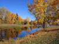

## imagepreview

Easy Image Preview with jQuery

## Features and Principle

What this script does is adds an element to the body when you roll over a certain object. That element’s appearance is predefined with css (positioned absolute and styled) so all we need to do is fill the element with content, calculate mouse position and make it move accordingly. When cursor is moved over he object, element moves with it and when cursor roll out, the element is deleted.

Here are couple of examples where you can see this script in action.

## Example

Here we have a bunch of thumbnails. When each thumbnail is rolled over, script will load an image that we have linked in HREF attribute of an A tag. That makes this method accessible as well, because user can still access the target image even with disabled JavaScript.

Html:

<code>&lt;a href="1.jpg" class="preview"&gt;&lt;img src="1s.jpg" alt="gallery thumbnail" /&gt;&lt;/a&gt;</code>

or if you want to use caption add a title attribute:

<code>&lt;a href="image.jpg" class="preview" title="Great looking landscape"&gt;Roll over to preview&lt;/a&gt;</code>

  <link rel="stylesheet" href="normalize.min.css"/>
  <link rel="stylesheet" href="style.min.css"/>
    <ul>
      <li></li>
      <li></li>
      <li></li>
      <li></li>
    </ul>
    <h2>Image gallery (with caption)</h2>
    <ul>
      <li></li>
      <li></li>
      <li></li>
      <li></li>
    </ul>
  
  
  
